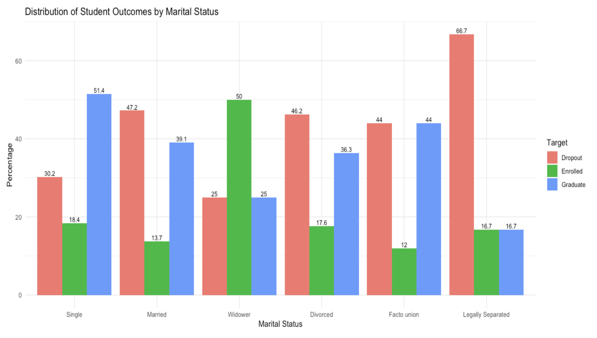
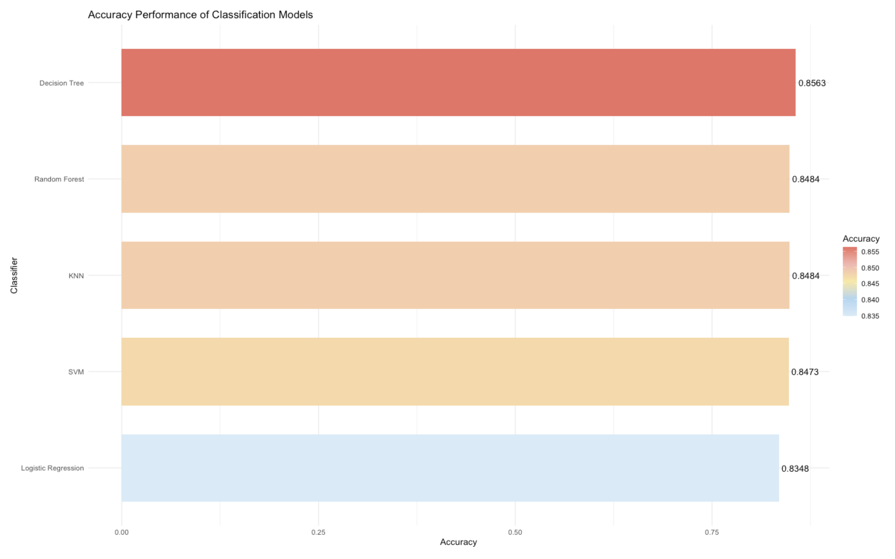

# 🎓 Predict Student Dropout

This repository contains my R code and analysis for predicting student dropout using multiple machine learning models, as part of an academic assignment.

---

## 📌 Introduction

This project aims to identify key factors that contribute to student dropout and to build predictive models using R. The dataset includes student demographic, academic, and socio-economic features.

The goal is to help educational institutions take proactive steps based on predictions and insights from the models.

---

## 💡 Motivation

With rising dropout rates in higher education, it's important to develop data-driven approaches to understand which students are at risk. Inspired by real-world problems, this project applies supervised learning techniques to help address the issue in a practical way.

---

### 📊 Key Visualisations

#### 1. Distribution of Student Outcomes by Marital Status



This chart shows how marital status influences student outcomes. Notably, legally separated students have the highest dropout rate (66.7%), while widowers are most likely to remain enrolled.

#### 2. Accuracy Comparison of Classification Models



This visual compares the performance of five classification models. Decision Tree performed best with 85.63% accuracy, followed closely by Random Forest and KNN.

## 🧪 Models Used

- Logistic Regression
- Decision Tree
- Random Forest
- Support Vector Machine (SVM)
- K-Nearest Neighbors (KNN)

Each model's performance was evaluated using accuracy and confusion matrices.

---

## 📁 Files

- `Khoi_30889472_Assignment3_code.Rmd`: R Markdown file containing all data preprocessing, model training, and evaluation steps.

---

## ▶️ How to Run the Code

1. Open the `.Rmd` file in RStudio.
2. Click `Knit` to render the report and view outputs.
3. You may need to install the following packages if not already installed:

```r
install.packages(c("tidyverse", "caret", "randomForest", "e1071", "class"))
